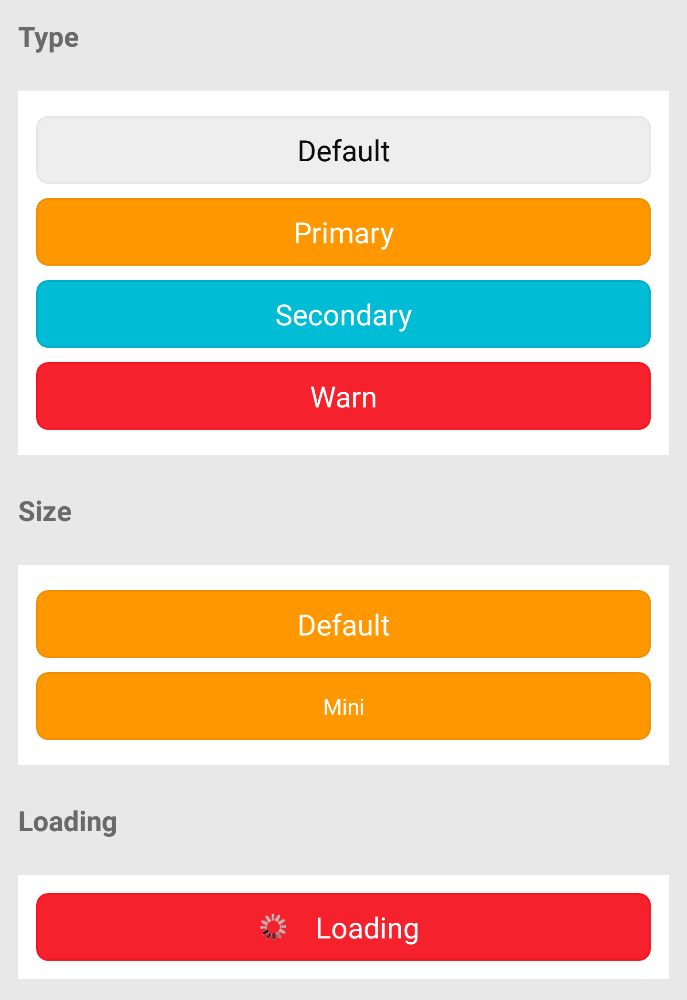

# Button

按钮。

| 属性名    | 类型 | 必填 | 默认值 | 说明 | 微信 | 支付宝 | 百度 | 快应用 |
| --- | --- | --- | --- | --- | --- | --- | --- | --- |
| disabled | Boolean | false | false | 是否禁用 |  |  |  | true |
| plain    | Boolean | false | | 按钮是否镂空，背景色透明 |  |  |  | true |
| type     | String  | false | default | 按钮的样式类型 | 可选值：default，primary，secondary，warn |  |  | true |
| size     | String  | false | default | 按钮的大小 | 可选值：default，mini |  |  | true |
| loading  | Boolean | false | false | 名称前是否带 loading 图标 |  |  |  | true |
| style | Object | {} | 用来设置按钮的样式 | true | true | true | true |
| onClick  | Function | false | | 点击的回调 |  |  |  | true |
| catchClick | Function | false | | 点击的回调 |  |  |  | true |
| onTap    | Function | false | | 点击的回调 |  |  |  | true |
| catchTap | Function | false | | 点击的回调 |  |  |  | true |

<p></p>

## 示例

基本使用：

```js
import React from '@react';
import XButton from '@components/XButton/index';
class P extends React.Component {
  handleClick(e) {
    console.log('click', e);
  }
  render() {
    return (
      <XButton onClick={this.handleClick.bind(this)}>Default</XButton>
    );
  }
}
export default P;
```

指定 Type：

```js
<XButton type="warn">
  Warn
</XButton>
```

Loading 状态：

```js
<XButton type="default" loading={true}>
  Loading
</XButton>
```

Disabled：

```js
<XButton type="default" disabled={true}>
  Loading
</XButton>
```