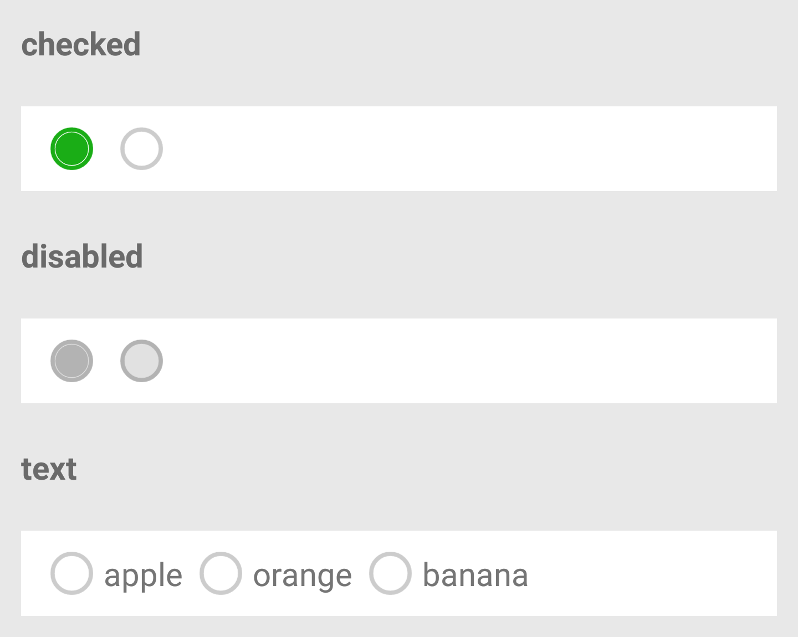

## RadioGroup

单项选择器，内部由多个 Radio 组成。

| 属性名 | 类型 | 必填 | 默认值 | 说明 | 微信 | 支付宝 | 百度 | 快应用 |
| --- | --- | --- | --- | --- | --- | --- | --- | --- |
| onChange | Function | false | | `RadioGroup` 中的 `Radio` 发生变化时触发 `onChange` 事件，`e.detail/target = { value: 选中 Radio 的 value }` | true | true | true | true |

## Radio

单项选择项，非受控组件。通常需搭配 RadioGroup 使用。

| 属性名 | 类型 | 必填 | 默认值 | 说明 | 微信 | 支付宝 | 百度 | 快应用 |
| --- | --- | --- | --- | --- | --- | --- | --- | --- |
| checked | Boolean | false | false | 当前是否选中 | true | true | true | true |
| disabled | Boolen | false | false | 是否禁用 | true | true | true | true |
| value | String | false | '' | `Radio` 标识。当该 `Radio` 选中时，`RadioGroup` 的 `onChange` 事件会携带 `Radio` 的 `value` | true | true | true | true |
| color | Color | false | `#1aad16` | `Radio` 的颜色，同 `css` 的 `color` | true | true | true | true |
| text | String | false | '' | 显示的文本 | true | true | true | true |
| isRight | Boolean | false | true | 文本是否显示在 `Radio` 的右侧，默认显示在右侧 | true | true | true | true |
| size | String | false | 'default' | `Radio` 的大小，有三种选项：`large`、`default`、`small` | true | true | true | true |

<p></p>

## 示例

基本用法：

```js
import React from '@react';
import XRadio from '@components/XRadio/index';
import XRadioGroup from '@components/XRadioGroup/index';
class P extends React.Component {
  constructor(props) {
    this.handleChange = this.checkboxChange.bind(this);
  }
  handleChange(e) {
    console.log('checkbox change', e);
  }
  render() {
    return (
      <XRadioGroup onChange={this.handleChange}>
        <XRadio
          checked={true}
          value="apple"
          text="苹果"
        />
        <XRadio
          checked={false}
          value="banana"
          text="香蕉"
        />
      </XRadioGroup>
    );
  }
}
export default P;
```