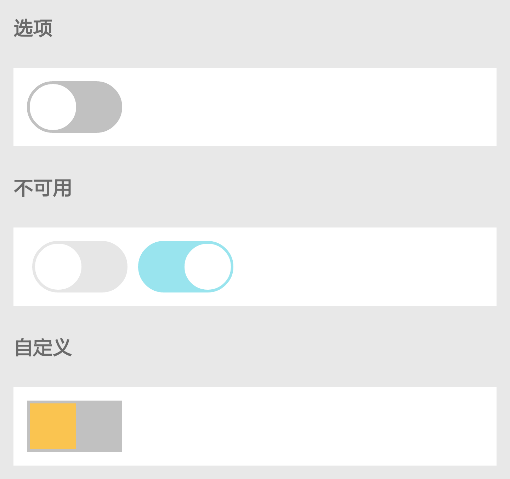

# Switch

开关选择器。

| 属性名 | 类型 | 必填 | 默认值 | 说明 | 微信 | 支付宝 | 百度 | 快应用 |
| --- | --- | --- | --- | --- | --- | --- | --- | --- |
| checked    | Boolean | false | false   | 是否选中 | true | true | true | true |
| disabled   | Boolean | false | false   | 是否禁用 | true | true | true | true |
| color      | String  | false | #2998F9 | switch 开启的颜色 | true | true | true | true |
| checkColor | String  | false | #C1C1C1 | switch 关闭的颜色 | true | true | true | true |
| wrapperStyle | Object  | false |  | 外层的样式 | true | true | true | true |
| innerStyle | Object  | false |  | 内部按钮的样式 | true | true | true | true |
| onChange   | Function | false |  | checked 改变时触发 change 事件: 传入参数为 { event: 事件, detail/target: { value: switch 值 } } | true | true | true | true |

<p></p>

## 示例

基本用法：

```js
import React from '@react';
import XSwitch from '@components/XSwitch/index';
class P extends React.Component {
  change(e) {
    console.log('change value', e);
  }
  render() {
    return (
      <div>
        <XSwitch checked={false} onChange={this.change.bind(this)} />
      </div>
    );
  }
}
export default P;
```

Disabled：

```js
<XSwitch checked={false} disabled={true} onChange={this.change.bind(this)} />
```

自定义样式：

```js
import React from '@react';
import XSwitch from '@components/XSwitch/index';
class P extends React.Component {
  constructor() {
    super();
    this.state = {
      innerStyle: {
        borderRadius: 0,
        backgroundColor: '#fac450'
      },
      wrapperStyle: {
        borderRadius: 0
      }
    };
  }

  change(e) {
    console.log('携带值：', e.detail.value);
    console.log('携带值：', e.target.value);
    console.log('携带事件：', e.event);
  }

  render() {
    return (
      <div>
        <XSwitch checked={false} onChange={this.change.bind(this)}
          color="red" innerStyle={this.state.innerStyle} wrapperStyle={this.state.wrapperStyle} />
      </div>
    );
  }
}

export default P;
```